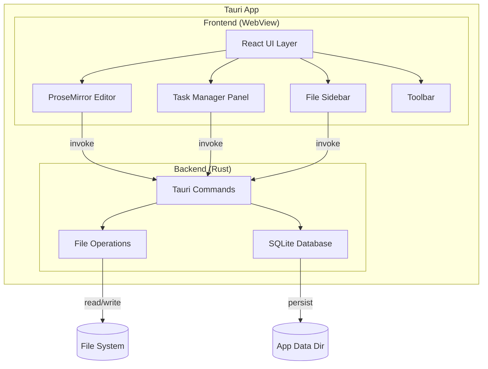
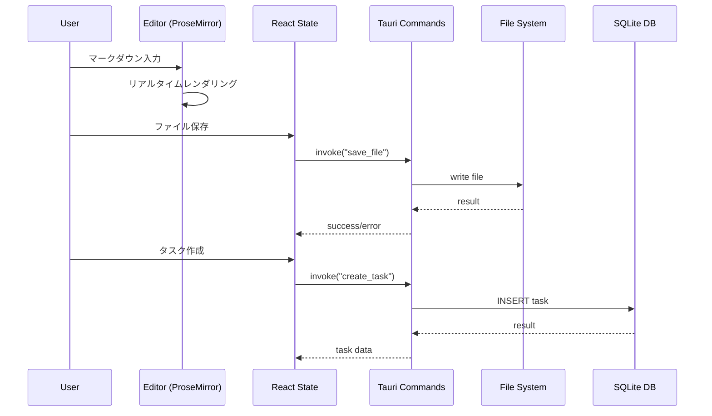
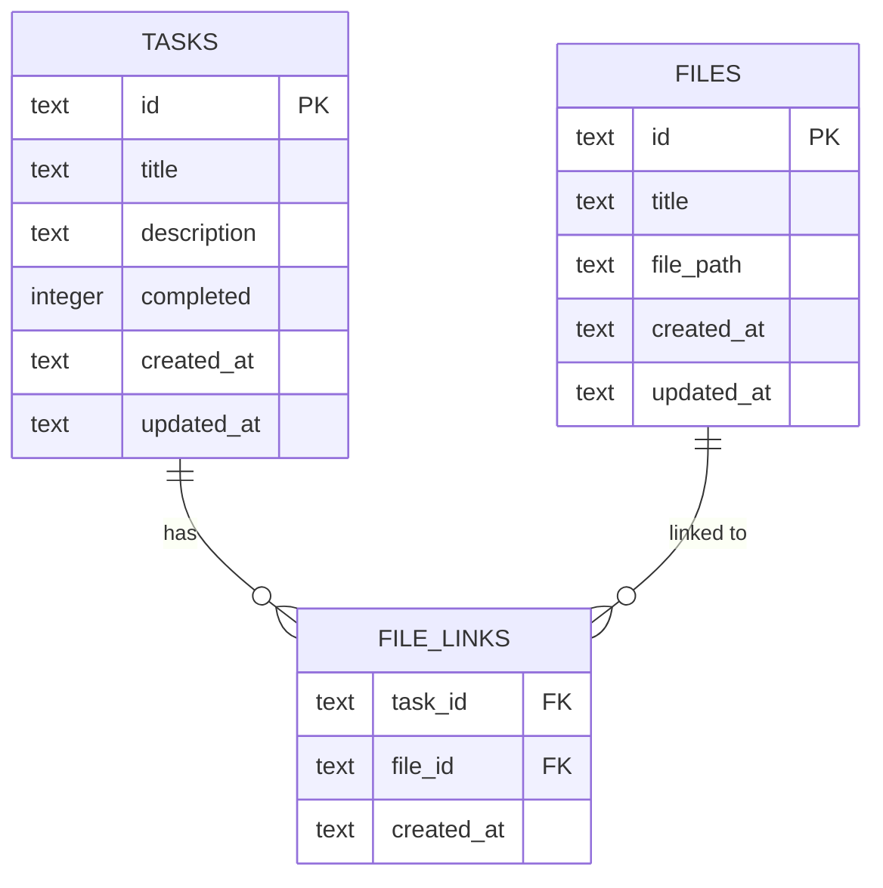

# 技術設計書: Markdown Editor with TODO

## 概要

Tauriフレームワーク（Rust バックエンド + Web フロントエンド）を用いたクロスプラットフォーム対応マークダウンエディタ。単一パネルでのWYSIWYGライクなリアルタイムレンダリング編集、TODOタスク管理、タスクとファイルの紐づけ機能を提供する。

フロントエンドはReact + TypeScriptで構築し、マークダウンのリアルタイムレンダリングにはProseMirrorを採用する。バックエンドはRustでファイルI/OとSQLiteベースのデータ永続化を担当する。

### 技術選定の根拠

| 技術 | 選定理由 |
|------|----------|
| Tauri v2 | 軽量なクロスプラットフォームデスクトップアプリ。Electronと比較してメモリ使用量が大幅に少なく、200MB以下の要件を満たしやすい |
| React + TypeScript | 型安全なUI開発。コンポーネントベースの設計でEditor/TaskManager/FileStoreの分離が容易 |
| ProseMirror | WYSIWYGエディタの業界標準。マークダウン構文のリアルタイムレンダリングとインライン編集を単一パネルで実現可能。スキーマベースでカスタマイズ性が高い |
| SQLite (via rusqlite) | 軽量な組み込みDB。タスクデータとファイル紐づけ情報の永続化に最適。Tauriのアプリデータディレクトリに配置 |
| Tailwind CSS | ユーティリティファーストのCSSフレームワーク。洗練されたUIを効率的に構築 |

## アーキテクチャ

### 全体構成



### レイヤー構成

1. **UIレイヤー（React）**: ユーザーインタラクションとレンダリング
2. **エディタレイヤー（ProseMirror）**: マークダウンの解析・レンダリング・編集
3. **コマンドレイヤー（Tauri Commands）**: フロントエンドとバックエンドの橋渡し
4. **データレイヤー（Rust）**: ファイルI/OとSQLite永続化

### データフロー




## コンポーネントとインターフェース

### フロントエンドコンポーネント

#### 1. App（ルートコンポーネント）

アプリケーション全体のレイアウトと状態管理を担当。

```typescript
// src/App.tsx
interface AppState {
  currentFile: MarkdownFile | null;
  viewMode: 'preview' | 'raw';
  sidebarVisible: boolean;
  taskPanelVisible: boolean;
}
```

#### 2. MarkdownEditor（ProseMirrorラッパー）

ProseMirrorを用いたWYSIWYGライクなマークダウンエディタ。

```typescript
// src/components/MarkdownEditor.tsx
interface MarkdownEditorProps {
  content: string;
  viewMode: 'preview' | 'raw';
  onChange: (content: string) => void;
}

// ProseMirrorスキーマ: マークダウン構文をノードとマークに変換
// - heading (h1-h6), paragraph, blockquote, code_block
// - horizontal_rule, ordered_list, bullet_list, list_item
// - image, hard_break
// Marks: bold, italic, strikethrough, code, link
```

#### 3. ViewToggle

表示モード切り替えトグルボタン。

```typescript
// src/components/ViewToggle.tsx
interface ViewToggleProps {
  currentMode: 'preview' | 'raw';
  onToggle: () => void;
}
```

#### 4. Toolbar

書式設定ボタンを提供。

```typescript
// src/components/Toolbar.tsx
interface ToolbarProps {
  editorView: EditorView | null;
}

type ToolbarAction = 
  | 'bold' | 'italic' | 'strikethrough'
  | 'heading1' | 'heading2' | 'heading3'
  | 'bulletList' | 'orderedList'
  | 'codeBlock' | 'link' | 'image';
```

#### 5. FileSidebar

ファイル一覧サイドバー。

```typescript
// src/components/FileSidebar.tsx
interface FileSidebarProps {
  files: MarkdownFile[];
  currentFileId: string | null;
  onFileSelect: (fileId: string) => void;
  onFileCreate: () => void;
  onFileDelete: (fileId: string) => void;
}
```

#### 6. TaskPanel

タスク管理パネル。

```typescript
// src/components/TaskPanel.tsx
interface TaskPanelProps {
  tasks: Task[];
  filter: TaskFilter;
  onFilterChange: (filter: TaskFilter) => void;
  onTaskCreate: (task: CreateTaskInput) => void;
  onTaskUpdate: (taskId: string, updates: UpdateTaskInput) => void;
  onTaskDelete: (taskId: string) => void;
  onFileLinkAdd: (taskId: string, fileId: string) => void;
  onFileLinkRemove: (taskId: string, fileId: string) => void;
  onFileOpen: (fileId: string) => void;
}

type TaskFilter = 'all' | 'incomplete' | 'completed';
```

### バックエンド（Tauri Commands）

```rust
// src-tauri/src/commands/file_commands.rs

#[tauri::command]
fn create_file(title: String) -> Result<MarkdownFile, String>;

#[tauri::command]
fn save_file(file_id: String, content: String) -> Result<(), String>;

#[tauri::command]
fn load_file(file_id: String) -> Result<MarkdownFile, String>;

#[tauri::command]
fn list_files() -> Result<Vec<MarkdownFile>, String>;

#[tauri::command]
fn delete_file(file_id: String) -> Result<(), String>;
```

```rust
// src-tauri/src/commands/task_commands.rs

#[tauri::command]
fn create_task(title: String, description: String) -> Result<Task, String>;

#[tauri::command]
fn update_task(task_id: String, title: Option<String>, description: Option<String>, completed: Option<bool>) -> Result<Task, String>;

#[tauri::command]
fn delete_task(task_id: String) -> Result<(), String>;

#[tauri::command]
fn list_tasks(filter: Option<String>) -> Result<Vec<Task>, String>;

#[tauri::command]
fn add_file_link(task_id: String, file_id: String) -> Result<FileLink, String>;

#[tauri::command]
fn remove_file_link(task_id: String, file_id: String) -> Result<(), String>;

#[tauri::command]
fn get_task_file_links(task_id: String) -> Result<Vec<MarkdownFile>, String>;
```


## データモデル

### フロントエンド型定義

```typescript
// src/types.ts

interface MarkdownFile {
  id: string;           // UUID
  title: string;        // ファイル名
  content: string;      // マークダウンテキスト
  filePath: string;     // ファイルシステム上のパス
  createdAt: string;    // ISO 8601
  updatedAt: string;    // ISO 8601
}

interface Task {
  id: string;           // UUID
  title: string;        // タスクタイトル
  description: string;  // タスク説明
  completed: boolean;   // 完了状態
  linkedFiles: string[];// 紐づけファイルID配列
  createdAt: string;    // ISO 8601
  updatedAt: string;    // ISO 8601
}

interface FileLink {
  taskId: string;       // タスクID
  fileId: string;       // ファイルID
  createdAt: string;    // ISO 8601
}

interface CreateTaskInput {
  title: string;
  description: string;
}

interface UpdateTaskInput {
  title?: string;
  description?: string;
  completed?: boolean;
}
```

### SQLiteスキーマ

```sql
-- タスクテーブル
CREATE TABLE tasks (
    id TEXT PRIMARY KEY,
    title TEXT NOT NULL,
    description TEXT NOT NULL DEFAULT '',
    completed INTEGER NOT NULL DEFAULT 0,
    created_at TEXT NOT NULL DEFAULT (datetime('now')),
    updated_at TEXT NOT NULL DEFAULT (datetime('now'))
);

-- ファイルメタデータテーブル
CREATE TABLE files (
    id TEXT PRIMARY KEY,
    title TEXT NOT NULL,
    file_path TEXT NOT NULL UNIQUE,
    created_at TEXT NOT NULL DEFAULT (datetime('now')),
    updated_at TEXT NOT NULL DEFAULT (datetime('now'))
);

-- タスク-ファイル紐づけテーブル
CREATE TABLE file_links (
    task_id TEXT NOT NULL,
    file_id TEXT NOT NULL,
    created_at TEXT NOT NULL DEFAULT (datetime('now')),
    PRIMARY KEY (task_id, file_id),
    FOREIGN KEY (task_id) REFERENCES tasks(id) ON DELETE CASCADE,
    FOREIGN KEY (file_id) REFERENCES files(id) ON DELETE CASCADE
);

-- インデックス
CREATE INDEX idx_file_links_task_id ON file_links(task_id);
CREATE INDEX idx_file_links_file_id ON file_links(file_id);
CREATE INDEX idx_tasks_completed ON tasks(completed);
```

### Rustデータ構造

```rust
// src-tauri/src/models.rs
use serde::{Deserialize, Serialize};

#[derive(Debug, Serialize, Deserialize, Clone)]
pub struct Task {
    pub id: String,
    pub title: String,
    pub description: String,
    pub completed: bool,
    pub linked_files: Vec<String>,
    pub created_at: String,
    pub updated_at: String,
}

#[derive(Debug, Serialize, Deserialize, Clone)]
pub struct MarkdownFile {
    pub id: String,
    pub title: String,
    pub content: String,
    pub file_path: String,
    pub created_at: String,
    pub updated_at: String,
}

#[derive(Debug, Serialize, Deserialize, Clone)]
pub struct FileLink {
    pub task_id: String,
    pub file_id: String,
    pub created_at: String,
}
```

### ER図




## 正当性プロパティ（Correctness Properties）

*プロパティとは、システムのすべての有効な実行において成立すべき特性や振る舞いのことです。人間が読める仕様と機械的に検証可能な正当性保証の橋渡しとなる、形式的な記述です。*

### Property 1: マークダウンパース・レンダリングのラウンドトリップ

*任意の*有効なマークダウンテキストに対して、マークダウンをProseMirrorドキュメントにパースし、そのドキュメントをマークダウンテキストにシリアライズした結果は、元のマークダウンテキストと意味的に等価であること。

**Validates: Requirements 1.1, 1.2, 1.4, 2.5**

### Property 2: ツールバーアクションによるマークダウン構文挿入

*任意の*ツールバーアクション（bold, italic, heading等）と*任意の*カーソル位置に対して、アクション実行後のドキュメントには対応するマークダウン構文（マークまたはノード）が挿入されていること。

**Validates: Requirements 1.6**

### Property 3: 表示モードトグルのラウンドトリップ

*任意の*表示モード（'preview' または 'raw'）に対して、トグルを2回実行した後のモードは元のモードと一致すること。

**Validates: Requirements 2.3**

### Property 4: rawモードでのテキスト保持

*任意の*マークダウンテキストに対して、rawマークダウンモードで表示される内容は入力されたソーステキストと完全に一致すること。

**Validates: Requirements 2.4**

### Property 5: モード切り替え時のカーソル位置保持

*任意の*ドキュメントと*任意の*有効なカーソル位置に対して、表示モードを切り替えた後のカーソル位置は切り替え前と同じ論理位置を指していること。

**Validates: Requirements 2.6**

### Property 6: ファイル保存・読み込みのラウンドトリップ

*任意の*有効なマークダウンテキストに対して、ファイルとして保存し、その後読み込んだ内容は元のテキストと完全に一致すること。

**Validates: Requirements 3.2, 3.3**

### Property 7: 未保存変更のダーティフラグ検出

*任意の*ファイルに対して、内容を変更した場合はダーティフラグがtrueになり、保存後はダーティフラグがfalseに戻ること。

**Validates: Requirements 3.7**

### Property 8: タスクCRUDラウンドトリップ

*任意の*有効なタスクデータ（タイトル、説明）に対して、タスクを作成し、その後読み取った結果は作成時のデータと一致すること。また、更新後の読み取り結果は更新データと一致し、削除後はタスクが存在しないこと。さらに、DB接続を再確立した後もデータが保持されていること。

**Validates: Requirements 4.1, 4.2, 7.1, 7.2, 7.3**

### Property 9: タスク完了状態の更新

*任意の*タスクに対して、完了状態をトグル（false→true、true→false）した後、タスクの完了状態は期待通りに反転していること。

**Validates: Requirements 4.4**

### Property 10: タスクフィルタリング

*任意の*タスクリストに対して、「未完了」フィルタを適用した結果にはcompleted=falseのタスクのみが含まれ、「完了」フィルタを適用した結果にはcompleted=trueのタスクのみが含まれること。

**Validates: Requirements 4.6**

### Property 11: ファイル紐づけラウンドトリップ

*任意の*タスクと*任意の*ファイルに対して、紐づけを作成した後、タスクの紐づけファイル一覧にそのファイルが含まれること。

**Validates: Requirements 5.1, 5.2**

### Property 12: ファイル紐づけ解除

*任意の*タスクと紐づけ済みファイルに対して、紐づけを解除した後、タスクの紐づけファイル一覧にそのファイルが含まれないこと。

**Validates: Requirements 5.5**

### Property 13: ファイル削除時のカスケード紐づけ削除

*任意の*ファイルに対して、そのファイルを削除した後、すべてのタスクの紐づけファイル一覧にそのファイルが含まれないこと。

**Validates: Requirements 5.6**


## エラーハンドリング

### フロントエンド

| エラー種別 | 対応方針 |
|-----------|---------|
| Tauri Command呼び出し失敗 | トースト通知でユーザーにエラーメッセージを表示。操作をリトライ可能にする |
| ファイル保存失敗（権限不足、ディスク容量不足） | エラーダイアログを表示し、別名保存を提案（要件3.6） |
| タスク作成・更新失敗 | トースト通知でエラーを表示。フォームの入力内容は保持する（要件4.7） |
| ProseMirrorパースエラー | フォールバックとしてrawテキスト表示に切り替え |

### バックエンド（Rust）

| エラー種別 | 対応方針 |
|-----------|---------|
| SQLiteデータベース接続失敗 | エラーログ出力。空の初期状態で起動（要件7.4） |
| データベース破損 | バックアップからの復元を試行。失敗時は空の初期状態で起動 |
| ファイルI/Oエラー | 具体的なエラーメッセージ（権限、パス不正等）をフロントエンドに返却 |
| データ整合性エラー（FK違反等） | トランザクションロールバック。エラーメッセージをフロントエンドに返却 |

### エラー型定義

```rust
// src-tauri/src/error.rs
use serde::Serialize;

#[derive(Debug, Serialize)]
pub enum AppError {
    FileNotFound(String),
    FileWriteError(String),
    FileReadError(String),
    DatabaseError(String),
    ValidationError(String),
    TaskNotFound(String),
}

impl std::fmt::Display for AppError {
    fn fmt(&self, f: &mut std::fmt::Formatter<'_>) -> std::fmt::Result {
        match self {
            AppError::FileNotFound(path) => write!(f, "ファイルが見つかりません: {}", path),
            AppError::FileWriteError(msg) => write!(f, "ファイル保存エラー: {}", msg),
            AppError::FileReadError(msg) => write!(f, "ファイル読み込みエラー: {}", msg),
            AppError::DatabaseError(msg) => write!(f, "データベースエラー: {}", msg),
            AppError::ValidationError(msg) => write!(f, "バリデーションエラー: {}", msg),
            AppError::TaskNotFound(id) => write!(f, "タスクが見つかりません: {}", id),
        }
    }
}
```

## テスト戦略

### テストアプローチ

ユニットテストとプロパティベーステストの二重アプローチを採用する。

- **ユニットテスト**: 具体的な例、エッジケース、エラー条件の検証
- **プロパティベーステスト**: すべての入力に対して成立すべき普遍的なプロパティの検証

両者は補完的であり、包括的なカバレッジのために両方が必要。

### プロパティベーステスト設定

- **フロントエンド**: [fast-check](https://github.com/dubzzz/fast-check)（TypeScript用PBTライブラリ）
- **バックエンド**: [proptest](https://github.com/proptest-rs/proptest)（Rust用PBTライブラリ）
- 各テストは最低100イテレーション実行
- 各テストにはデザインドキュメントのプロパティ番号をタグとしてコメントに記載
- タグ形式: **Feature: markdown-editor-with-todo, Property {number}: {property_text}**
- 各正当性プロパティは1つのプロパティベーステストで実装する

### テスト対象マッピング

| プロパティ | テスト種別 | テスト対象 | ライブラリ |
|-----------|-----------|-----------|-----------|
| P1: マークダウンラウンドトリップ | PBT | ProseMirrorスキーマ + パーサー | fast-check |
| P2: ツールバー構文挿入 | PBT | Toolbarコマンド関数 | fast-check |
| P3: モードトグルラウンドトリップ | PBT | ViewToggle状態管理 | fast-check |
| P4: rawモードテキスト保持 | PBT | Editor rawモード表示ロジック | fast-check |
| P5: カーソル位置保持 | PBT | Editor モード切り替えロジック | fast-check |
| P6: ファイル保存・読み込みラウンドトリップ | PBT | Rust file_commands | proptest |
| P7: ダーティフラグ検出 | PBT | ファイル変更検出ロジック | fast-check |
| P8: タスクCRUDラウンドトリップ | PBT | Rust task_commands + SQLite | proptest |
| P9: タスク完了状態更新 | PBT | Rust task_commands | proptest |
| P10: タスクフィルタリング | PBT | タスクフィルタロジック | fast-check / proptest |
| P11: ファイル紐づけラウンドトリップ | PBT | Rust file_link commands + SQLite | proptest |
| P12: ファイル紐づけ解除 | PBT | Rust file_link commands | proptest |
| P13: カスケード紐づけ削除 | PBT | Rust file/link commands + SQLite FK | proptest |

### ユニットテスト対象

| 要件 | テスト内容 |
|------|-----------|
| 1.5 | Toolbarに必要なボタンがすべて存在することの確認 |
| 2.1, 2.2 | 表示モードの初期状態とトグルボタンの表示確認 |
| 3.1 | ファイル新規作成の基本動作確認 |
| 3.4, 3.5 | サイドバーのファイル一覧表示とファイル選択動作 |
| 3.6 | ファイル保存失敗時のエラーメッセージ表示（エッジケース） |
| 4.3 | タスク作成フォームの表示確認 |
| 4.5 | タスク一覧パネルの表示確認 |
| 4.7 | タスク作成・更新失敗時のエラーメッセージ表示（エッジケース） |
| 5.3, 5.4 | タスク詳細の紐づけファイル一覧表示とファイルオープン動作 |
| 7.4 | データ読み込み失敗時の空初期状態起動（エッジケース） |
