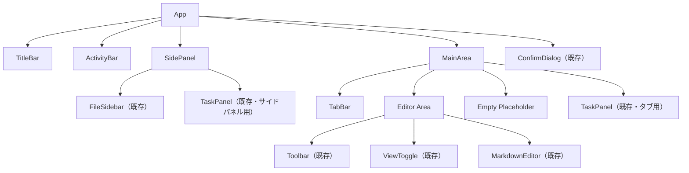
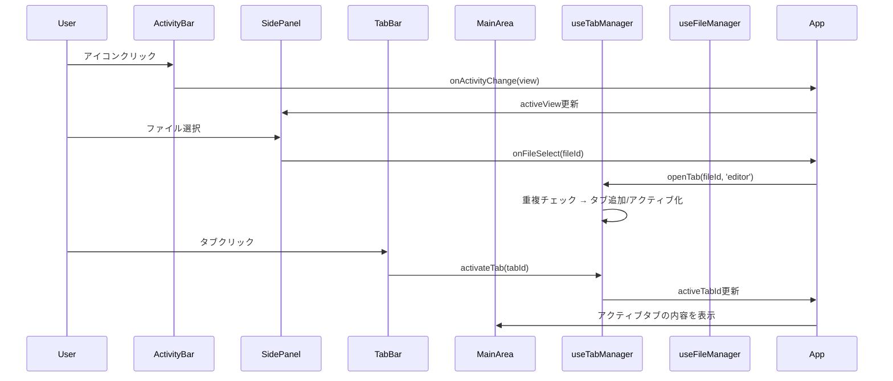

# 設計ドキュメント: 2ペインレイアウト

## 概要 (Overview)

現在の nibu アプリケーションは3ペイン構成（FileSidebar + MarkdownEditor + TaskPanel）で、各ペインが固定的に配置されている。本設計では、VS Code 風の2ペイン構成（ActivityBar + SidePanel + MainArea）に移行し、タブベースのマルチファイル編集を実現する。

### 設計方針

- 既存コンポーネント（FileSidebar, TaskPanel, MarkdownEditor, Toolbar, ViewToggle, TitleBar, ConfirmDialog）は変更せず再利用する
- 新規コードは最小限にし、既存コードとの差分のみを実装する
- `useFileManager` は単一ファイル管理のまま維持し、タブごとに独立したインスタンスを生成する設計とする
- 状態管理は React の useState/useCallback で完結させ、外部状態管理ライブラリは導入しない

### 変更の影響範囲

- `App.tsx`: レイアウト構造を3ペインから2ペインに書き換え（最大の変更箇所）
- 新規コンポーネント: `ActivityBar`, `SidePanel`, `TabBar`
- 新規フック: `useTabManager`（タブ状態管理）
- 既存コンポーネント: 変更なし

## アーキテクチャ (Architecture)

### レイアウト構造

```
┌─────────────────────────────────────────────────┐
│ TitleBar                                        │
├────┬──────────┬─────────────────────────────────┤
│    │          │ TabBar                          │
│ A  │  Side    ├─────────────────────────────────┤
│ c  │  Panel   │                                 │
│ t  │          │ MainArea                        │
│ i  │ (Files   │ (MarkdownEditor / TaskPanel     │
│ v  │  or      │  / Empty placeholder)           │
│ i  │  Tasks)  │                                 │
│ t  │          │                                 │
│ y  │          │                                 │
│ B  │          │                                 │
│ a  │          │                                 │
│ r  │          │                                 │
├────┴──────────┴─────────────────────────────────┤
```

### コンポーネント階層



### データフロー




## コンポーネントとインターフェース (Components and Interfaces)

### 新規コンポーネント

#### ActivityBar

ウィンドウ左端に配置されるアイコンベースの縦型ツールバー。

```typescript
type ActivityView = 'files' | 'tasks';

interface ActivityBarProps {
  activeView: ActivityView | null;  // null = サイドパネル非表示
  onActivityChange: (view: ActivityView | null) => void;
}
```

動作:
- アイコンクリック → 対応するビューをサイドパネルに表示
- アクティブなアイコンを再クリック → サイドパネルを非表示（`null` を渡す）
- アクティブなアイコンは視覚的にハイライト（背景色変更 + 左ボーダー）

#### SidePanel

ActivityBar の右隣に表示されるリサイズ可能なパネル。

```typescript
interface SidePanelProps {
  activeView: ActivityView;
  // FileSidebar 用 props
  currentFileId: string | null;
  onFileSelect: (fileId: string) => void;
  // TaskPanel 用 props
  onFileOpen: (fileId: string) => void;
  onOpenTaskTab: () => void;
}
```

動作:
- `activeView` に応じて FileSidebar または TaskPanel を切り替え表示
- CSS `resize: horizontal` または drag ハンドルでリサイズ可能
- 既存の FileSidebar と TaskPanel をそのまま子コンポーネントとしてレンダリング

#### TabBar

メイン領域上部に配置されるタブ一覧。

```typescript
type TabType = 'editor' | 'task';

interface Tab {
  id: string;           // タブの一意識別子
  type: TabType;
  fileId?: string;      // editor タブの場合のファイルID
  title: string;        // タブに表示するタイトル
  isDirty: boolean;     // 未保存変更の有無
}

interface TabBarProps {
  tabs: Tab[];
  activeTabId: string | null;
  onTabClick: (tabId: string) => void;
  onTabClose: (tabId: string) => void;
}
```

動作:
- タブクリック → `onTabClick` でアクティブタブ切り替え
- 閉じるボタン → `onTabClose` でタブ閉じ処理（未保存ガード付き）
- アクティブタブは視覚的に区別（下ボーダー + 背景色）
- 未保存インジケーター（● マーク）を isDirty なタブに表示

### 新規フック

#### useTabManager

タブの開閉・アクティブ化・重複防止を管理するカスタムフック。

```typescript
interface UseTabManagerReturn {
  tabs: Tab[];
  activeTabId: string | null;
  activeTab: Tab | null;
  openEditorTab: (fileId: string, title: string) => void;
  openTaskTab: () => void;
  closeTab: (tabId: string) => void;
  activateTab: (tabId: string) => void;
  updateTabDirty: (tabId: string, isDirty: boolean) => void;
  updateTabTitle: (tabId: string, title: string) => void;
}
```

動作:
- `openEditorTab`: fileId で重複チェック → 既存ならアクティブ化、なければ新規追加
- `openTaskTab`: task タブの重複チェック → 既存ならアクティブ化、なければ新規追加
- `closeTab`: タブを配列から削除 → アクティブタブが閉じられた場合は隣接タブをアクティブ化
- `updateTabDirty`: 特定タブの isDirty フラグを更新（未保存インジケーター用）

### 既存コンポーネントの再利用方法

| コンポーネント | 再利用方法 | 変更 |
|---|---|---|
| TitleBar | そのまま使用 | なし |
| FileSidebar | SidePanel 内で使用 | なし |
| TaskPanel | SidePanel 内 + Task_Tab 内で使用 | なし |
| MarkdownEditor | Editor_Tab 内で使用 | なし |
| Toolbar | Editor_Tab のツールバーとして使用 | なし |
| ViewToggle | Editor_Tab のツールバーとして使用 | なし |
| ConfirmDialog | タブ閉じ時の確認ダイアログとして使用 | なし |

### App.tsx の変更

App.tsx は最大の変更箇所となる。現在の3ペイン直接配置から、新規コンポーネントを組み合わせた2ペイン構成に書き換える。

主な変更点:
1. `useFileManager` を単一インスタンスから、アクティブなエディタタブに応じた管理に変更
2. `useTabManager` フックの導入
3. ActivityBar + SidePanel + MainArea のレイアウト構成
4. タブ閉じ時の未保存ガード処理の追加

#### useFileManager のマルチタブ対応

現在の `useFileManager` は単一ファイルを管理する設計。マルチタブ対応には以下の選択肢がある:

**採用案: タブごとに useFileManager を呼び出す Map ベースの管理**

`useFileManager` 自体は変更せず、タブごとのファイル状態を `Map<tabId, FileManagerState>` で App レベルで管理する。ただし、React Hooks はループ内で呼べないため、各エディタタブコンポーネント内で `useFileManager` を呼び出す形にする。

具体的には:
- 新規 `EditorTabContent` コンポーネントを作成し、内部で `useFileManager` を呼ぶ
- タブ切り替え時はコンポーネントの mount/unmount ではなく、CSS `display: none` で非表示にして状態を保持する
- これにより各タブが独立した `useFileManager` インスタンスを持ち、自動保存やダーティフラグが独立して動作する

```typescript
// EditorTabContent: 各エディタタブの内容を管理するラッパー
interface EditorTabContentProps {
  fileId: string;
  isActive: boolean;
  onDirtyChange: (isDirty: boolean) => void;
  onTitleChange: (title: string) => void;
}
```


## データモデル (Data Models)

### タブ状態

```typescript
type TabType = 'editor' | 'task';

interface Tab {
  id: string;           // 一意識別子（editor タブ: `editor-${fileId}`, task タブ: `task`）
  type: TabType;        // タブ種別
  fileId?: string;      // editor タブの場合のファイルID
  title: string;        // 表示タイトル
  isDirty: boolean;     // 未保存変更フラグ
}
```

タブ ID の命名規則:
- エディタタブ: `editor-${fileId}` — fileId による重複防止が容易
- タスクタブ: `task` — 固定ID（常に1つのみ）

### アクティビティバー状態

```typescript
type ActivityView = 'files' | 'tasks';

// App レベルの状態
interface LayoutState {
  activeActivity: ActivityView | null;  // null = サイドパネル非表示
  tabs: Tab[];
  activeTabId: string | null;
}
```

### 既存データモデル（変更なし）

以下の型は `src/types.ts` で定義済みであり、変更しない:

- `MarkdownFile`: ファイルメタデータ + コンテンツ
- `Task`: タスクデータ
- `FileLink`: タスク-ファイル紐づけ
- `CreateTaskInput`, `UpdateTaskInput`, `TaskFilter`

### 状態の永続化

タブ状態やアクティビティバー状態は、現時点では永続化しない（アプリ再起動時にリセット）。将来的に localStorage や Tauri の設定ファイルで永続化する余地を残す。


## 正当性プロパティ (Correctness Properties)

*プロパティとは、システムのすべての有効な実行において成り立つべき特性や振る舞いのことである。人間が読める仕様と機械的に検証可能な正当性保証の橋渡しとなる形式的な記述である。*

### Property 1: エディタタブの開き冪等性

*任意の* fileId のリストに対して、それぞれを openEditorTab で開いた後、各 fileId に対応するタブはタブリスト内に最大1つしか存在せず、最後に開いた fileId のタブがアクティブである。

**Validates: Requirements 3.2, 3.3**

### Property 2: タスクタブのシングルトン性

*任意の* 回数 openTaskTab を呼び出した後、タブリスト内のタスクタブは常に最大1つであり、そのタブがアクティブである。

**Validates: Requirements 4.2**

### Property 3: タブ閉じによる除去

*任意の* タブリストと、そのリスト内の任意のタブに対して、closeTab を呼ぶとそのタブはリストから除去され、タブ数が1つ減少する。

**Validates: Requirements 3.4**

### Property 4: タブアクティブ化

*任意の* タブリストと、そのリスト内の任意のタブIDに対して、activateTab を呼ぶと activeTabId がそのタブIDに更新される。

**Validates: Requirements 3.5**

### Property 5: タブ表示の完全性

*任意の* タブ配列に対して、TabBar コンポーネントはすべてのタブのタイトルをレンダリングし、isDirty が true のタブには未保存インジケーターを表示し、isDirty が false のタブにはインジケーターを表示しない。

**Validates: Requirements 3.1, 3.7**

### Property 6: 未保存タブ閉じガード

*任意の* isDirty が true のエディタタブに対して、閉じ操作を実行すると、タブは即座に閉じられず、保存確認フローが開始される。

**Validates: Requirements 5.1**


## エラーハンドリング (Error Handling)

### タブ操作のエラー

| シナリオ | 対処 |
|---|---|
| ファイル読み込み失敗（タブ開き時） | `useFileManager` の既存エラーハンドリングに委譲。エディタ領域にエラーメッセージを表示 |
| ファイル保存失敗（タブ閉じ時） | `useUnsavedChangesGuard` + `useFileManager` の既存フローに委譲。保存失敗時はタブを閉じない |
| 存在しないファイルIDでタブを開こうとした場合 | `useFileManager.loadFile` が Tauri バックエンドからエラーを受け取り、エラー状態を設定 |

### サイドパネルのエラー

- FileSidebar と TaskPanel は既存のエラーハンドリング（内部 state でエラー表示）をそのまま使用
- 新規のエラーハンドリングは不要

### 状態の整合性

- タブで開いているファイルがサイドバーから削除された場合: ファイル読み込みエラーとして処理（既存の `useFileManager` のエラーハンドリング）
- 自動保存中にタブを閉じた場合: `useFileManager` の `closeFile` がタイマーをクリアするため、安全に処理される

## テスト戦略 (Testing Strategy)

### テストアプローチ

ユニットテストとプロパティベーステストの二本立てで網羅的にカバーする。

### プロパティベーステスト

ライブラリ: **fast-check** (TypeScript 向けプロパティベーステストライブラリ)

各プロパティテストは最低100回のイテレーションで実行する。各テストには設計ドキュメントのプロパティ番号をタグとしてコメントに記載する。

タグフォーマット: **Feature: two-pane-layout, Property {number}: {property_text}**

| プロパティ | テスト内容 | 生成戦略 |
|---|---|---|
| Property 1: エディタタブの開き冪等性 | ランダムな fileId リストで openEditorTab を連続呼び出し、各 fileId のタブが最大1つであることを検証 | `fc.array(fc.uuid())` で fileId リストを生成 |
| Property 2: タスクタブのシングルトン性 | ランダムな回数 openTaskTab を呼び出し、タスクタブが最大1つであることを検証 | `fc.nat({max: 20})` で呼び出し回数を生成 |
| Property 3: タブ閉じによる除去 | ランダムなタブリストを構築し、ランダムなタブを閉じて、タブ数が1つ減ることを検証 | `fc.array(fc.uuid())` でタブリストを生成、`fc.nat()` で閉じるインデックスを生成 |
| Property 4: タブアクティブ化 | ランダムなタブリストを構築し、ランダムなタブをアクティブ化して、activeTabId が更新されることを検証 | 同上 |
| Property 5: タブ表示の完全性 | ランダムなタブ配列（isDirty ランダム）で TabBar をレンダリングし、全タブのタイトルとインジケーターを検証 | `fc.array(fc.record({...}))` でタブ配列を生成 |
| Property 6: 未保存タブ閉じガード | isDirty=true のタブに対して閉じ操作を実行し、確認フローが開始されることを検証 | `fc.uuid()` で fileId を生成 |

各プロパティテストは単一の property-based test として実装する。

### ユニットテスト

ユニットテストは具体的な例、エッジケース、統合ポイントに焦点を当てる。プロパティテストが広範な入力をカバーするため、ユニットテストは最小限にする。

| テスト対象 | テスト内容 |
|---|---|
| ActivityBar | アイコンクリックでビュー切り替え、再クリックでトグル |
| SidePanel | activeView に応じた FileSidebar/TaskPanel の切り替え表示 |
| TabBar | アクティブタブの視覚的区別、空タブ時の表示 |
| useTabManager | 初期状態（空タブ）、タブ閉じ後の隣接タブアクティブ化 |
| App 統合 | Ctrl+S ショートカット、タブなし時のプレースホルダー表示 |

### テストツール

- **Vitest**: テストランナー
- **React Testing Library**: コンポーネントテスト
- **fast-check**: プロパティベーステスト
